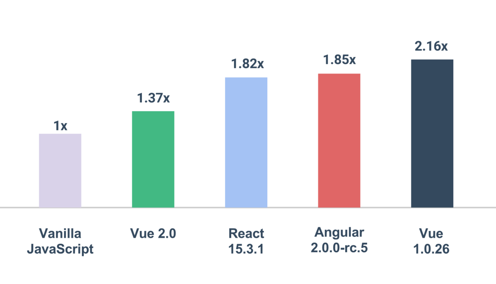
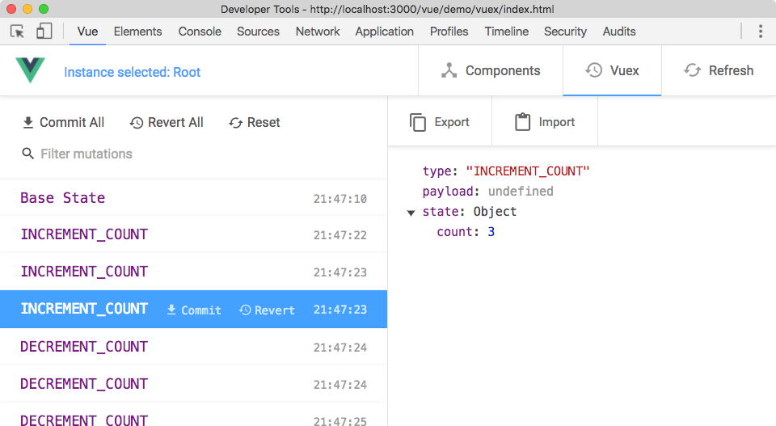

<!--top-->
# 💓 Vue.js

2016/11/19 - 静岡JavaScript勉強会 #4 [@nakajmg](https://twitter.com/nakajmg)

[#shizuoka_js](https://twitter.com/search?q=%23shizuoka_js)

---

こんにちは。今日はVue.jsについて話させてもらいます。

-----

# 


- [@nakajmg](https://twitter.com/nakajmg)（じまぐ）
- [株式会社ピクセルグリッド](https://www.pxgrid.com/)
- フロントエンド・エンジニア


---

どうもはじめまして、じまぐです。ピクセルグリッドという会社からやってまいりました。
フロントエンド・エンジニアという肩書きで、JavaScriptを書いて生計をたてています。
nakajmgというidで活動しています。

-----
<!--cover-vue-->
# はなします

- Vue.jsについて
- プログレッシブ・フレームワーク
- ライブラリ/ツール紹介

---

今日はとにかくJavaScriptフレームワークのVue.jsについて話します。

-----
<!--cover-vue-->

# Vue.jsとは

- Viewに特化
- コンポーネントシステム
- リアクティブなレンダリング

---

まずはじめに、Vue.jsの特徴について軽くふれておきます。
Vue.jsはUIを組み立てるようなViewの部分に特化したライブラリです。
アプリケーションをコンポーネントの単位でわけて定義して、そのコンポーネントを組み合わせることでアプリケーションが作れます。  
Vue.jsはデータの変更に合わせて、表示も更新されるような、リアクティブなレンダリング機能を持っています。これによってデータの変更を監視して、表示を更新する、みたいなめんどくさい処理を書く必要がありません。  

-----
<!--iitokoro-->
# 💓Vue.jsのいいところ

---

さて、それではここから、ひたすらVue.jsのいいところを紹介していきますので、おつきあいください。

-----
<!--wakaba-->
# 💓とにかくシンプル

- 🔰 APIが理解しやすい
- 😆 直感的に書ける（__気持ちいい__）
- ✨ コードがきれいな状態を保ちやすい ✨

---

まずVue.jsはとにかくシンプルです。APIが理解しやすくて直感的に書けるんですね。  
直感的に使えるフレームワークって使っててなんか気持ちいいですよね。

記述がシンプルなので、自然とコードが綺麗な状態っていうのが保てるようになります。
自分や他人が書いたコードが、あとから読んだときに理解しやすい状態にしておけるってのは大事ですよね。

-----
<!--code-->
<iframe src="./demo/hello/index.html" width="600px" height="400px">
</iframe>

[demo/hello](./demo/hello/index.html)


---

このデモは、Vue.jsの解説とかでよくでてくるデータバインディングのデモです。
インプットの要素と、その内容を出力する要素の２つがあります。

インプットボックスを編集すると、出力のほうも同時に変わります。

-----
<!--code-->
```html
<div id="app"></div>
<script src="./vue.js"></script>
<script>
  new Vue({
    el: '#app',
    template: `<div>
      <p><input v-model="message"></p>
      <p>{{message}}</p>
    </div>`,
    data() {
      return {
        message: 'Hello Vue.js'
      }
    }
  })
</script>
```

---

このコードが、今のデモのコードです。この十数行でさっきのようなリアクティブな処理が実装できちゃいます。

このコードなんか目を通したら何が何をやっているか、なんとなく理解できちゃう気がしませんか？

それって正にVue.jsのシンプルさとわかりやすさを表していて、ちょっとの学習ですぐにだれでも使えるようなフレームワークなのかなと思ってます。

-----
<!--wakaba-->

## 💓覚えやすく便利

- 宣言的なテンプレート
- リアクティブなレンダリング
- 純粋なJavaScriptオブジェクトモデル

---

さっきのコードのように、テンプレートの部分をあらかじめ宣言しておきます。
そしてデータの追加や更新をもとに、リアクティブなレンダリングをしてくれます。

Vue.jsって純粋なJavaScriptのオブジェクトモデルで書ける、っていうのもわかりやすさ、覚えやすさのひとつです。

-----
<!--wakaba-invert-->
## 学習コストは低いほうがいい

ときとして軽視されがちだが、走る前の/走ってる  
プロジェクトにアサインされる人の負担が小さいことに越したことはない

---

学習コストは低いほうがいい、って何を当たり前のことを言ってるんだ、という感じですが  
たまーにこの学習コストを軽視するマッチョな人がいたりするんですよね。  
プロジェクトとかに関わる人たちの負担って小さいほうがいいですよね。

-----
<!--power-->
## 少ない学習で大きなパワー💪

---

Vue.jsはフレームワークの中でもかなり学習コストが低い方です。jQueryが書けるくらいのJS力があれば、Vue.js使い始めるのは難しくないと思います。

すごい簡単に使えるんですが、それでも他のフレームワークに比べて劣ってる、というわけではないんです。

-----
<!--hayai-->
# 💓軽くて速い

<small>参考：[ほかのフレームワークとの比較](https://vuejs.org/v2/guide/comparison.html)</small>

---

Vue.js、軽くて速いんです。

-----
<!--cover-hayai-->

# 軽い

Name                       | Size (min+gzip)
-------------------------- | -------------
Vue 2.0                    | **23kb**
React 15.3.0 + React DOM   | 43kb
Angular 1.4.5            | 51kb 
Angular 2                  | 111kb
Angular 2 + Rx             | **143kb**

<!-- Vue 2.0 + vue-router + vuex| 26K -->

<blockquote>
<a href="https://gist.github.com/Restuta/cda69e50a853aa64912d">Restuta/framework-sizes.md</a>
,
<a href="https://medium.com/the-vue-point/vue-2-0-is-here-ef1f26acf4b8#28bf">Vue 2.0 is Here!#Perfomance</a>
</blockquote>

---

この表はVueとReactとAngularのファイルサイズを比較したものです。この数値はminifyととgzip圧縮を書けた数値です。

どうでしょう、Vue.js軽いですよね。

-----
<!--cover-hayai-->
# 速い



<blockquote>
<a href="https://medium.com/the-vue-point/vue-2-0-is-here-ef1f26acf4b8#28bf">Vue 2.0 is Here!#Perfomance</a>
,
<a href="http://stefankrause.net/js-frameworks-benchmark4/webdriver-ts/table.html">Results for js web frameworks benchmark</a>
</blockquote>

---

軽いだけじゃなくて、速いんです。

このグラフは、レンダリングのベンチマークのスコアを比較したもので、数値が低いほどパフォーマンスが優れていることを示しています。グラフを見るとAngularよりもReactよりも速い、という結果がでています。

-----
<!--super-->
# 強い

---

軽くて速いって、それだけでも結構強くないですか？

-----
<!--hatena-->

## 本当に強いの❓

🤔「他のフレームワークより軽くて速いのはわかった  
けどAngularとVueじゃ対処できる領域の広さが違うぞ。Vue.jsは同じ土俵に立てるの？」

---

でもVue.jsが軽くて速いのってViewの部分に特化したライブラリだからであって、Angularみたいなフルスタックなフレームワークと比較するのってなんかフェアじゃないような印象もありますよね。

これはまぁその通りという感じで、Vue.jsだけだとAngularが解決できるような領域っていうのは解決できないです。アプリケーションの規模っていうのが大きくなるとVue.jsだけでは立ち向かえないです。

そうなると結局Vue.jsってそんなに強くないのでは、と思うかもしれないんですけど、そうではないんですね。

-----
<!--houyouryoku-->
## 💓Vue.jsはどんな規模にも<br>対応できるフレームワーク

---

実際のところ、Vue.jsはどんな規模にも対応できるフレームワークです。
じゃあVue.jsがどうやって規模の大きいアプリケーションに対応するかってのを説明する前に、  
ちょっとだけアプリケーションそのものについて、考えてみます。

-----
<!--seityou-->
## アプリケーションは成長する

アプリケーションは作って終わりということは少なく、機能追加など新しい要求によって段階的に成長していく

---

アプリケーションやサービスって、作ってはい終わり、ってことって少ないですよね？  

-----
<!--youkyuu-->

### 要求に合わせて拡張・変更したい…

🤔「ここ変更するならクライアントルーティングしてシングルステートな感じでモジュールもほかのサービスで使いまわせるようにしたほうがヨサソウだな…」

---

機能追加とかの新しい要求が出てきて、段階的に成長していくものだと思います。  
アプリケーションの利用者が増えたりしたときって、拡張・改善したいっていう希望が必ずといっていいほど出てくると思います。

-----
<!--tsurami-->

### 要求に対応できないフレームワークだと…

🤔「今使ってるフレームワークだとめんどくさみあって厳しいし、そもそもこれに対応できるかあやしい😥別のフレームワークで作り直したほうが早いまであるぞ😱」

---

でもアプリケーションを作るのに使ってるフレームワークによっては、希望するような拡張が難しいことってあると思います。  
フレームワークってそれぞれ解決したい問題も異なりますし、そのフレームワーク独自の制約みたいなものってありますよね。

-----
<!--okane-->

## 初期の技術選定が<br>サービスの成長に影響する

初期の要求だけに合わせてフレームワークを選ぶと  
のちのち苦労することになりかねない。将来的な要求の変化に対応できるフレームワーク選びが重要☝🏻

---

アプリケーションやサービスの最初の要件にだけ合わせてフレームワークを選んじゃうと、  
将来的な要求にフレームワークが対応できない、なんてことも起こりえるわけです。

だから技術選定の段階で未来のことも考えておくのって大事なことなんですけど、これなかなか上手くはできないですよね。

-----
<!--important-->
## Vue.js単体では<br>小規模なSPAぐらいまで

- <span style="font-size: 1.5em; vertical-align: middle;">😄</span> キャンペーン/コンポーネント</span>✨
- <span style="font-size: 1.5em; vertical-align: middle;">😉</span> 小規模SPA/プロトタイプ 👍
- <span style="font-size: 1.5em; vertical-align: middle;">😫</span> 中規模SPA 💦
- <span style="font-size: 1.5em; vertical-align: middle;">👺</span> 大規模SPA 🔥

---

Vue.jsの話にもどりますが、最初のほうで紹介したとおり、Vue.jsはViewの部分に特化したライブラリです。  
この中だとキャンペーンサイトやプロトタイプ、小規模なシングルページアプリケーションぐらいまでがVue.jsの得意な範囲です。

中規模以上のアプリケーションにVue.jsだけで立ち向かおうとすると火傷すると思います。ただしこれはVue.js単体で使ったときの話なんです。

-----
<!--progressive_framework-->


<blockquote>
<a href="https://docs.google.com/presentation/d/1zQ3Frm3DxSw_qY-KEuykkIUREO-ueFbOyMd1Kd8nqKE/edit#slide=id.g5fc474681_041">https://docs.google.com/presentation/d/1zQ3Frm3DxSw_qY-KEuykkIUREO-ueFbOyMd1Kd8nqKE/edit#slide=id.g5fc474681_041</a>
</blockquote>

---

Vue.jsの作者のEvan氏はアプリケーションの段階っていうのを、この図のように６つの領域にわけています。  

-----
<!--progressive_framework-bg-->
## ６つの領域

- Declarative Rendering
- Component System
- Client-Side Routing
- Large Scale State Management
- Build System
- Clinet-Server Data Persistence

---

宣言的なレンダリング、コンポーネントシステム、クライアントサイドルーティング、状態管理、ビルドシステム、クライアントとサーバのデータ永続化と。  

Vue.jsだけを使った場合だと、この図でいうコンポーネントシステムのところまでをカバーしてます。

-----
## あらゆる規模に対応？<br>どうやって？

---
<!--hatena-->
じゃあVue.jsがどうやってあらゆる規模に対応するのかって話です。  
ちょっとVue.jsのトップページを見てみましょう。

-----
<!--cover-progressive-->

---

Vue.jsのトップページを見ると「Progressive Framework」っていう単語がでてきています。
これは作者のEvan氏が提唱しているフレームワークの概念なんです。 
このプログレッシブフレームワークっていったいなにかってことなんですが

-----
<!--juunan-->
## Progressive Framework

アプリケーションの段階的な要求の変化に対応して  
そのときの規模に合わせて必要なだけスケールできる  
柔軟性をもつフレームワーク

<small>参考: [Vue.js: The Progressive Framework](https://docs.google.com/presentation/d/1WnYsxRMiNEArT3xz7xXHdKeH1C-jT92VxmptghJb5Es/edit#slide=id.p)</small>

---

Evan氏はプログレッシブフレームワークを「アプリケーションの段階的な要求の変化に対応できて、規模に合わせて必要なだけスケールできる柔軟性をもったフレームワーク」と定義しています。  

-----
<!--hatena-->

## 最初からフルスタックなのを<br>使えばいいのでは？

---

でも段階的じゃなくて、もう全部最初からAngularのようなフルスタックな物を採用しておけば対応できるじゃん。って思うかもしれませんが、それでいいかっていうとそんなわけないですよね。

-----
<!--hukou-->

## その選択が<br>誰かを不幸にするかも

規模に合ってないようなフレームワークの選択が開発の妨げとなり誰かを不幸にするかもしれない

---

例えば、jQueryで十分なようなページをAngularみたいなフルスタックなフレームワークで作るようなことってやりたくないですよね。

でもアプリケーションの先のことを考えると、いろいろとカバーできるものがビジネス的に求められるってのも理解できます。

じゃあ最初はjQueryで作っておいて、必要になったら別のフレームワークで作り直して、また拡張が必要になったらもっと高機能なフレームワークで作り直すとか、そんなのもやりたくないですよね。

-----
<!--siawase-->
# 💓Vue.jsはみんなを<br>ハッピーにしたい

---

このプログレッシブフレームワークって、Vue.jsを使う人達をハッピーにしたいっていう考えの形なのかなと自分は思っています。

-----
<!--tool-->
## Vue.jsをサポートする<br>ライブラリ/ツールを使って<br>あらゆる規模に対応できる

---
じゃあVue.jsがどうやってあらゆる規模に対応するかというと、Vue.jsをサポートするライブラリやツールによって対応します。

サポートライブラリやツールはいろいろあるんですが、その中でもよく使うメジャーなものを紹介します。

-----
<!--tool-->
## 公式のライブラリ/ツール

- ルーティング：[vue-router](https://github.com/vuejs/vue-router)
- 状態管理：[vuex](https://github.com/vuejs/vuex)
- ビルドシステム：[vue-loader](https://github.com/vuejs/vue-loader)/[vueify](https://github.com/vuejs/vueify)
- デバッグ：[vue-devtools](https://github.com/vuejs/vue-devtools)
- そのほか色々… 👉 [github.com/vuejs/](https://github.com/vuejs)

---

vue-routerはクライアントサイドのルーティングライブラリで、  
vuexはFluxのようなアプリケーションの状態管理をするためのライブラリです。  

アプリケーションの規模が大きくなって、コンポーネントの管理などが難しくなってきたら  
vue-loaderやvueifyといったビルドシステムを使います。

vue-devtoolsはChromeのエクステンションなんですが、インストールしておくとVue.jsでの開発中のデバッグ作業がとても楽になります。

その他にも色々とライブラリやツールが用意されています。

-----
<!--hayai-->
### Vue + vue-router + vuex = 26kb (min+gzip)

<blockquote>
<a href="https://medium.com/the-vue-point/vue-2-0-is-here-ef1f26acf4b8#.r62wzjr25">Vue 2.0 is Here!#Performance</a>
</blockquote>

---
最初の方にVue.jsは軽い、という話をしましたが、色々いれたら結局重くなるのでは、と思うかもしれません。これはVue本体とvue-routerとvuexを足したファイルサイズなんですが、それでもとっても軽いですね。

-----
<!--hatena-->

## Reactも同じような<br>感じじゃない？

---
フロントエンドに詳しい人であれば、これまでのプログレッシブフレームワークの話を聞いて「なんかそれReactも同じような感じじゃない？」て思ったかもしれません。

Vue.jsとReactで異なるのは、ライブラリやツールを公式で用意しているかどうかという点です。

-----
<!--tool-->
## 公式がライブラリ/ツールを<br>提供している

---

さきほどのリストで紹介したのはほんの一部ですが、公式が提供しているライブラリやツールが本当に充実しています。それがVue.jsがプログレッシブフレームワークを名乗っている理由でもあります。

-----
<!--annsin-->
## 💓公式サポートという安心感

Vue.js本体のアップデートにライブラリ/ツールも追従  
してサポートが続く。サードパーティ製ライブラリだとアップデートに追従できない可能性がある☝🏻

---

この公式が提供していることって大事だと思っていて、  
公式が提供しているものであれば、本体のアップデートに合わせてほかのライブラリも更新されますよね。

サードパーティ製のものだと、本体のアップデートに追従できなかったり、しない可能性が公式のものよりは高いと思います。

-----
<!--hatena-->
## 結局なんやかんや色々と<br>覚えないといけないのでは！？

---

学習コストの話にもどりますが、覚えやすくて簡単だといったんですが、いま紹介したライブラリやツールみたいなものも覚える必要があって  
結局学習コストがそれほど低くないのでは？と感じるかもしれません

-----
## 必要なものを<br>必要なときに覚える
<!--kaidan-->
全部を覚える必要はない。要件に応じて使うものを必要なときに導入し、その都度覚えればいい☝🏻

---

ですが、いま紹介したようなライブラリやツールが、絶対に必要ってわけではないんですね。

フルスタックと呼ばれるようなフレームワークであれば、使うのに必要な学習コストってフレームワークが持っている機能と比例して高くなっていきます。  
なぜかというと、フレームワークのある機能が、作ってるアプリケーションに必要か必要じゃないかにかかわらず、フレームワークの全体像を理解することが求められるんですよね。

でもVue.jsの場合、アプリケーションの規模によって、何を使い何を使わないかっていうのは柔軟に自由に選択できます。  
だから選択したものをその都度覚えればいいんです。

-----
<!--hatena-->

## 何から始めればいい？

---

じゃあVue.js使う上で、何から始めればいいのかっていう話なんですが

-----
<!--guide-->
# まずはガイドを読もう

Vue.jsがどういうものか、どう使えばいいかは  
[公式のガイド](http://vuejs.org/v2/guide/)に詰め込まれている☝🏻

<small>[(日本語訳は公開目前)](https://github.com/vuejs/jp.vuejs.org/tree/lang-ja-2.0/src/v2/guide)</small>

---

まずは公式にあるこのガイドを読んでみてください。  
Vue.jsがどんなものでどう使えばいいかというのが全て乗っています。

-----
<!--guide-->
## 💓ドキュメントがすごい

- [vuejs/Guide](http://vuejs.org/v2/guide/)
- [vuejs/API](http://vuejs.org/v2/api/)
- [vue-router（日本語）](http://router.vuejs.org/ja/index.html)
- [vuex](http://vuex.vuejs.org/en/)
- [vue-loader](http://vue-loader.vuejs.org/en/index.html)

---

使ってる途中に何かわからないことがあっても、Vue.jsはドキュメントが手厚く親切にかかれているので、大概の問題はドキュメントで解決しちゃいます。

ドキュメントが親切でも、英語で書かれてると尻込みするなーという人も大丈夫です。

-----
<!--nihon-->
## 日本語のサポートも十分に

- [コアチーム](https://github.com/orgs/vuejs/people)に日本人がいる [](https://twitter.com/kazu_pon)[](https://twitter.com/ktsn)[](https://twitter.com/tejitak)
- [日本語翻訳プロジェクト](https://github.com/vuejs/jp.vuejs.org)がある
- [日本ユーザー向けグループ](https://vuejs-jp-slackin.herokuapp.com/)（Slack）がある

---

自分が知る限りですが、Vue.jsのコアチームには日本人の方が3人います。おかげで最新の情報も得やすいですし、フィードバックも伝えやすいと思います。

日本語翻訳のプロジェクトがあって、これには誰でも参加できます。自分もVue.jsの2.0のドキュメントの翻訳に少し参加しました。ライブラリ本体へのコントリビュートが難しくても、こういった部分でコントリビュートしやすいというのもよい点ですね。

-----
<!--houyouryoku-->
# まとめ

---

さてこのへんで一旦、ここまでをまとめてみましょう。

-----
<!--end-->

# Vue.jsは強い

- 💪 少ない学習で大きなパワー
- 💨 軽くて速い
- 👐 ライブラリ/ツールでどんな規模にも対応
- 📖 ドキュメントがすごい
- 🇯🇵 日本語コミュニティの存在

---

Vue.jsがなんか強そうというのは感じてもらえたかなーと思います。

軽くて速くて、どんな規模にも対応できる、そんなパワーを少ない学習でも得ることができます。  
ドキュメントもしっかりしてますし、日本語のコミュニティがあるので、リソースに困ることはあまりないかと思います。

-----
<!--jikan-->
## ❓🤔❓

if (🕒) {  
　　location.hash = [#ライブラリツールの紹介](#46)  
}  
else {  
　　location.hash = [#その他のリソース](#65)  
}  

-----

<!--tool-->
## ライブラリ/ツールの紹介

---

さて、ここからはさきほど紹介した公式ライブラリとツールの特徴や使い方を解説します。

-----
<!--bg-vuex-->
## [Vuex](https://github.com/vuejs/vuex)

- FluxとかRedux for Vue.js
- アプリケーションの状態を一元的に管理
- アプリケーションの複雑性を解消するため

---

まずはVuexです。VuexはFluxのような状態管理パターンをVue.jsで行うためのライブラリです。  
ReduxなどのFlux系ライブラリとVue.jsを組み合わせることもできますが、Vue.jsに最適化されていて、とてもよく機能します。

-----
<!--vuex-->

<blockquote>
<a href="https://github.com/vuejs/vuex/">https://github.com/vuejs/vuex/</a>
</blockquote>

---

これはVuexのデータフローを表した図です。  
アプリケーションはStateという単一の状態をもっていて、この状態はMutationsによってのみ変更されます。  
ほかの経路では状態が変更できないようになっています。  
状態に変更があると自動的にコンポーネントがレンダリングされ直します。

-----
<!--bg-vuex-->

## Vuexの効能

- データフローが一方向に
- コンポーネント同士のやりとりが不要に
- 信頼できる唯一の情報源 (single source of truth)
- 状態変更が明示的かつ追跡可能に 👉 ✨vue-devtools✨

---

Vuexを導入すると、先ほどのようにデータフローが一方向になって、アプリケーション全体の見通しがよくなります。

アプリケーションの状態は単一のStateとして持つことになるので、Stateの信頼性が保証されるようになります。Stateを参照すれば常に最新の状態が得られることになります。

Vuexを導入すると状態変化が明示的になることで、このあと紹介するvue-devtoolsでの状態監視が行えるようなるという利点があります。

-----
<!--bg-vuex-invert-->

## 中規模以上のSPAで使おう

規模の小さなアプリケーションにVuexを導入すると冗長であまり効果のない制約を生み出すことに。  
[シンプルなイベントバスの仕組み](https://vuejs.org/v2/guide/components.html#Non-Parent-Child-Communication)でも十分機能する☝🏻

---

Vuexが有用なライブラリであることは間違いないと思いますが、規模の小さなシンプルなアプリケーションであれば使う必要はないでしょう。

Vuexを導入することでコードが冗長になって、あまり効果のない制約だけが生まれることになります。

小さなアプリケーションであれば、メディエーターパターンのような、イベントバスを介したやり取りで十分かと思います。

-----
<!--devtools-->
## [vue-devtools](https://github.com/vuejs/vue-devtools)

- コンポーネントの状態確認
- ルーティングの状態確認（vue-router）
- 状態変化の追跡とタイムトラベル（vuex）

---

vue-devtoolsはVue.jsアプリのデバッグ用のChrome拡張です。Chromeにインストールすると、

-----
<!--devtools-->
### コンポーネントの状態確認


---

コンポーネントの状態を確認したり、

-----
<!--devtools-->
### 状態変化の追跡とタイムトラベル



---

また、さきほど言ったようなVuexによる状態変化を追跡して状態のタイムトラベル機能が実現できます。

-----
<!--code-->

<iframe src="./demo/vuex/index.html" width="600px" height="400px">
</iframe>

[demo/vuex](./demo/vuex/index.html)

---

これはボタンを押すとカウントが増減するアプリです。Vuexが使われてます。

vue-devtoolsで確認してみましょう。incrementとdecrementをするとMutationが増え、状態が変化してるのが確認できます。

この状態変化のリストをクリックすると、好きな地点に行ったり来たりできます。これがタイムトラベルです。

便利そうですよね。デバッグが捗ります。

-----
<!--tool-list-->
## [vue-loader](https://github.com/vuejs/vue-loader)/[vueify](https://github.com/vuejs/vueify)

- webpack/Browserifyでバンドル
- 1コンポーネント1ファイル（.vue）

---

次にvue-loaderとvueifyです。この２つは、アプリケーションのJavaScriptをバンドルをするためのツールです。また、これを導入するとVue.jsでのコンポーネント開発がより便利に簡単ににできるようになります。

具体的に言うと、コンポーネントを.vueという拡張子のファイルで作っていくことになります。

-----
<!--code-->

.vue
```html
<template>
  <div class="my-component"><span>{{message}}</span></div>
</template>
<style lang="scss" scoped>
  .my-component {
    color: tomato;
    span { border: 1px solid #000; }
  }
</style>
<script>
  export default {
    data() { return { message: 'Hello!!' } }
  }
</script>
```

---

.vueファイルでは、このように一つのファイルにコンポーネントのtemplate/style/scriptの３つを記述します。

１コンポーネント１ファイルという、わかりやすい単位で作れるようになります。  
この形式であればコンポーネントに使うスタイルやテンプレートがまとめられるので、管理が簡単になります。

-----
<!--tool-list-->
## .vueファイル

- JS：ES2015で書ける（babel）
- CSS：プリプロセッサ（Sass/Stylus）が使える
- Scoped CSSのエミュレート/CSS Modules
- Hot Module Replacement（HMR、差分更新）

---

.vueファイルではデフォルトでJavaScriptをES2015で記述できます。  
またCSSは、SassやStylusといったプリプロセッサも簡単に使うことができます。

さらに、.vueファイルではCSSのスタイルをコンポーネントに閉じ込めることができます。  
これはScoped CSSやCSS ModulesといったものでCSSをカプセル化します。

-----
<!--code-->
CSS Modules

```html
<style module>
  .red {
    color: red;
  }
</style>
<template>
  <p :class="$style.red">
    This should be red
  </p>
</template>
<script>
export default {
  created () {
    console.log(this.$style.red)
  }
}
</script>
```

---

これはCSS Modulesの例です。styleの属性としてmoduleというのを指定します。  
すると$styleという特別な変数にクラスなどが格納されます。

templateでは$style.redのように、定義したクラスを参照します。このコードがコンパイルされると、$styleという変数名がアプリケーションの中でユニークな値と置き換えられ、ほかのクラスと衝突しなくなります。

-----
<!--iitokoro-->
### 💓CSSのクラス名で悩まなくてもいい

Scoped CSSやCSS Modulesを使うことによって、  
コンポーネントのスタイルがほかのスタイルに影響を  
与えなくなる


---

Scoped CSSやCSS Modulesを使うと何が嬉しいかというと、  
コンポーネントのスタイルがほかのスタイルに影響を与えなくなるんですね。

つまりもうCSSのクラス名で悩まなくてもいいってことなんです。すごくないですか？

-----
<!--tool-list-->
## [vue-cli](https://github.com/vue-cli)

- スキャフォールド用のコマンドラインツール
- vue-loader/vueifyの環境構築
- 開発用のローカルサーバの構築

---

最後にvue-cliです。これはコマンドラインツールで、Vue.jsを使ったアプリケーションの環境構築を簡単にしてくれます。

-----
<!--cli-->
### webpackのテンプレートを使ってみる

`$ vue init webpack awesome-project`

- A full-featured Webpack
- vue-loader setup with hot reload
- linting
- testing & css extraction.


---

例えばwebpackを使ったプロジェクトを作るときはこんなコマンドを実行します。

-----
<!--code-->

Y/nで必要な環境をセットアップ

```bash
$ vue init webpack awesome-project

? Project name awesome-project
? Vue build standalone
? Use ESLint to lint your code? Yes
? Pick an ESLint preset AirBNB
? Setup unit tests with Karma + Mocha? Yes
? Setup e2e tests with Nightwatch? No

   vue-cli · Generated "awesome-project".
   
   To get started:
    cd awesome-project
    npm install
    npm run dev
```

---

するとこんな感じにコマンドラインで何を使うか質問されます。質問にYesかNoで答えると、Yesと答えたやつをセットアップしてくれます。

セットアップが終わったら、npm installしてnpm run devを実行すると開発用のローカルサーバを立ち上げることができます。

（時間があればあらかじめインストールしといたやつでrun devする）

-----
<!--raku-->

- めんどくさい環境構築をスキップできる
- 公式のテンプレートがいい感じ（カスタマイズも可能）
- ESLint/ユニットテスト/E2Eテストの環境構築もしてくれる

---

このようにvue-cliを使うとめんどくさい環境構築がスキップできます。公式で用意しているテンプレートもいい感じです。

Lintやテストの環境も作ってくれて至れり尽くせりですね。公式のテンプレートをForkすればテンプレートのカスタマイズもできます。

-----
<!--relax-invert-->
# 手を抜こう

めんどくさいやつはツールに任せて  
もっと本質的な部分に集中する💪

---

フロントエンドのツール、なんか色々あるしどんどん難しくなってる感じありますよね。

設定とかって、やりたくてやってるわけじゃないことですし、手を抜けるとこは抜いていきましょう。  
さて、これでライブラリとツールの紹介はおしまいです。

-----
<!--tool-->
## その他のリソース

[awesome-vue](https://github.com/vuejs/awesome-vue/)

---

紹介した以外にも、いろいろなライブラリやツールがあります。  
Vue.jsに関するリソースは公式非公式に関わらず、このawesome-vueというリポジトリにまとまってます。  
ここにはプラグインもあれば、誰かが作った便利そうなコンポーネントなんかもあります。  
なにか作る前に、ちょっとここを探してみるとぴったりなものが見つかるかもしれません。
-----
<!--cover-vue-cover-->

---

さて、ここまでVue.jsについて色々と紹介してきましたがどうでしょう？なんかヨサソウなフレームワークだなーと思ってくれたなら幸いです。

ところで、フロントエンドのフレームワークって移り変わりがとても激しいですよね。

-----
<!--hatena-->
## 使い続けられる？

🤔「AngularはGoogle、ReactはFacebook、うしろに大企業がいてなんか大丈夫そう。Vueは個人が作ってるみたいだけどどうなの？」

---

少し前まで「これはずっと使えそう」と思ってたものが、今はもう誰も使ってないなんて状況がありがちなのがフロントエンドのフレームワークです。

AngularであればGoogle、ReactであればFacebookといった大企業がそれぞれうしろについているので、なんとなく使い続けられそうなイメージを持てますよね。

Vue.jsはどこかの企業が作ったわけではなく、個人によって作られたOSSです。  
そういった点でフレームワークの継続性みたいなのが心配になる人もいるかと思います。

-----
<!--sponser-->
## 💰スポンサーがついてる💰

- [👆9000＄/month](https://www.patreon.com/evanyou)
- フルタイムOSS
- [Laravel](https://laravel.com/)のデフォルトにもなった

---

ですがそういった心配はあまり必要ないのかなと、個人的には思っています。  
というのも、Vue.jsの作者はいろいろな企業や個人に金銭的な支援をされていて、フルタイムでOSSの開発にあたっているそうです。

あとは少し前の話になりますが、PHPフレームワークのLaravelのデフォルトのJSフレームワークになったことも話題になりましたね。

-----
<!--super-->
## コミュニティが強いOSSは強い

---

Vue.jsは特定の一企業ではなく、Vue.jsを使っている企業や個人の支持によって支えられています。  
日本でも翻訳プロジェクトに色々な人が参加してますし、実際に案件に投入している例も見かけられるようになってきました。  
コミュニティが強いOSSって強いものだと個人的には思います。ですので、保証は全くできませんが、長く使い続けられるフレームワークだと思います。

-----
<!--tukatte-->
# 使ってみよう

[https://vuejs.org/](https://vuejs.org/)

---

ここまで話を聞いて、ちょっと使ってみようかなと思った人はすぐに公式サイトにアクセスしましょう。Vue.jsの始め方はとても簡単です。

-----
<!--start-->

### あなたの人生を変えるかもしれない一行

```html
<script src="https://unpkg.com/vue/dist/vue.js"></script>
```

---

HTMLにこのscriptを一行追加してください。  
もしかしたら、あなたの人生が変わるほどの何かを得られるかもしれません。

-----
<!--end2-->
# 👍Thanks

[@nakajmg](https://twitter.com/nakajmg)

---

ご清聴ありがとうございました。

-----
<!--codegrid-->

## Vue.jsの連載やってます

## 👉 [CodeGrid](http://www.codegrid.net/) 👈

---

弊社がやってるCodeGridというサービスでVue.jsの連載やってます。
