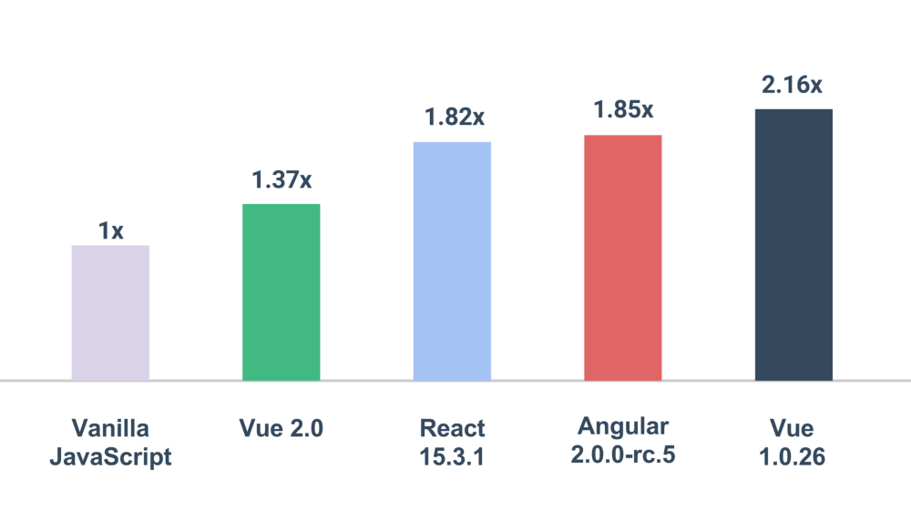
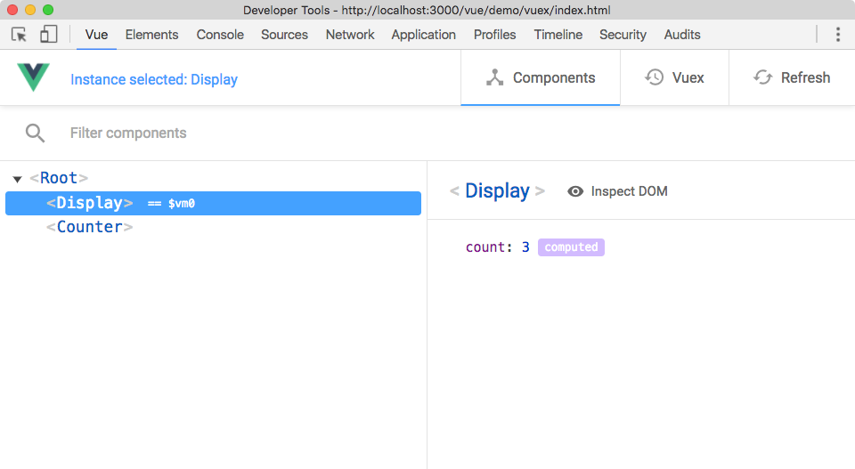
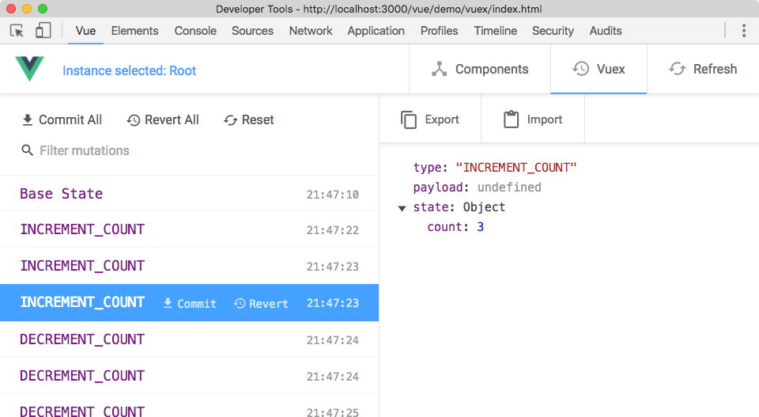

<!--top-->
# 💓 Vue.js

2016/11/19 - 静岡JavaScript勉強会 #4 [@nakajmg](https://twitter.com/nakajmg)

[#shizuoka_js](https://twitter.com/search?q=%23shizuoka_js)

-----

# 


- [@nakajmg](https://twitter.com/nakajmg)（じまぐ）
- [株式会社ピクセルグリッド](https://www.pxgrid.com/)
- フロントエンド・エンジニア


---
.
どうもはじめまして、じまぐです。ピクセルグリッドという会社からやってまいりました。
フロントエンド・エンジニアという肩書きで、JavaScriptを書いて生計をたてています。
nakajmgというidで活動しています。

-----
<!--cover-vue-->
# はなします

- Vue.jsのいいところ
- サポートライブラリ/ツール
- そのほか

---

今日はとにかくJavaScriptフレームワークのVue.jsについて話します。

-----
<!--cover-vue-->

# Vue.jsについて

- Viewに特化したライブラリ
- コンポーネント指向
- Simple & Easy

---

Vue.jsはUIを組み立てるViewの部分に特化したライブラリです。
アプリケーションを構成するコンポーネントをHTMLのタグのようなレベルにわけて定義することで、再利用性の高いコンポーネントの作成を可能にします。
そしてAPIなどがとてもシンプルでわかりやすく、とにかく簡単に使えるようになる、というのが特徴です。
どれくらいシンプルなのか、少しみてみましょう。

-----
<!--iitokoro-->
# 💓Vue.jsのいいところ

---

それではここから、ひたすらVue.jsのいいところを紹介します。

-----
<!--wakaba-->
# 💓とにかくシンプル

- 🔰 APIが理解しやすい
- 😆 直感的に書ける（__気持ちいい__）
- ✨ コードがきれいな状態を保てる ✨

---

まずとにかくシンプルです。APIが理解しやすく、直感的に書けます。
直感的に使えるフレームワークって書いてて気持ちいいですよね。

シンプルなので、自然とコードが綺麗な状態を保てます。
自分や他人が書いたコードが、あとから読んだときに理解しやすい状態にしておけるってのは大事ですよね。

-----
<!--code-->
<iframe src="./demo/hello/index.html" width="600px" height="400px">
</iframe>

[demo/hello](./demo/hello/index.html)


---
.
これはVue.jsの説明をするうえでよく登場するデータバインディングのデモです。
HTML上にはインプットボックスと、その内容を出力するタグの２つがあります。

インプットボックスを編集すると出力も同時に変わります。

-----
<!--code-->
```html
<div id="app"></div>
<script src="./vue.js"></script>
<script>
  new Vue({
    el: '#app',
    template: `<div>
      <p><input v-model="message"></p>
      <p>{{message}}</p>
    </div>`,
    data() {
      return {
        message: 'Hello Vue.js'
      }
    }
  })
</script>
```

---

このデモのコードとしてはこれですべてです。
わずか十数行でデモのようなリアクティブなプログラムが実装できてしまいます。

このコード、目を通したら何が何をやっているか、なんとなく理解できちゃいますよね？

これは正にVue.jsのシンプルさを表していて、だれでもちょっとの学習ですぐに使い始められるフレームワークだと思います。

-----
<!--wakaba-->

## 💓覚えやすく便利

- 宣言的なテンプレート
- リアクティブなレンダリング
- 純粋なJavaScriptオブジェクトモデル

---

先ほどのコードのように、テンプレートはあらかじめ宣言しておきます。
そしてデータの追加や更新をもとに、リアクティブなレンダリングをしてくれます。

純粋なJSのオブジェクトモデルで書けるのも覚えやすさのひとつです。

-----
<!--wakaba-invert-->
## 学習コストが低いということ

ときとして軽視されがちだが、走る前の/走ってる  
プロジェクトにアサインされる人の負担が小さいことに越したことはない

---

たまーに学習コストを軽視するマッチョな人がいたりするんですが、プロジェクトとかに関わる人たちの負担なんて小さいほうがいいに決まってますよね。


-----
<!--power-->
## 少ない学習で大きなパワー💪

---

Vue.jsはフレームワークの中でもかなり学習コストが低い方です。それでも他のフレームワークに比べて劣ってるところはないです。それどころか勝ってすらいます。

-----
<!--hayai-->
# 💓軽くて速い

<small>参考：[ほかのフレームワークとの比較](https://vuejs.org/v2/guide/comparison.html)</small>

---

Vue.js、軽くて速いんです。

-----
<!--cover-hayai-->

# 軽い

Name                       | Size (min+gzip)
-------------------------- | -------------
Vue 2.0                    | **23kb**
React 15.3.0 + React DOM   | 43kb
Angular 1.4.5            | 51kb 
Angular 2                  | 111kb
Angular 2 + Rx             | **143kb**

<!-- Vue 2.0 + vue-router + vuex| 26K -->

<blockquote>
<a href="https://gist.github.com/Restuta/cda69e50a853aa64912d">Restuta/framework-sizes.md</a>
,
<a href="https://medium.com/the-vue-point/vue-2-0-is-here-ef1f26acf4b8#28bf">Vue 2.0 is Here!#Perfomance</a>
</blockquote>

---

この表はVueとReactとAngularのファイルサイズを比較したものです。どの数値もminifyしたあとgzip圧縮されたものです。

Vue.js、軽いですね〜。

-----
<!--cover-hayai-->
# 速い



<blockquote>
<a href="https://medium.com/the-vue-point/vue-2-0-is-here-ef1f26acf4b8#28bf">Vue 2.0 is Here!#Perfomance</a>
,
<a href="http://stefankrause.net/js-frameworks-benchmark4/webdriver-ts/table.html">Results for js web frameworks benchmark</a>
</blockquote>

---

このグラフは、ベンチマークのスコアを比較したもので、数値が低いほどパフォーマンスに優れていることを示しています。AngularよりもReactよりも速いですね。

Vue.js、速いですね〜。

-----
<!--super-->
# 強い

---

いや〜Vue.js、強いですね〜。

-----
<!--hatena-->

## 本当に強いの❓

🤔「他のフレームワークより軽くて速いのはわかった  
けどAngularとVueじゃ対処できる領域の広さが違うぞ。Vue.jsは同じ土俵に立てるの？」

---

「いやいや、軽いのはViewに特化したライブラリだからで、フルスタックなAngularと比較するのはフェアじゃないでしょう」という声が聞こえた気がします。

そうですね、Vue.jsだけだとAngularが解決できるような領域は解決できないです。中規模〜大規模なアプリケーションなどはVue.jsだけでは立ち向かえません。

じゃあ結局そんなに強くないのでは、と思うかもしれませんが、そうではないんです。

-----
<!--houyouryoku-->
## どんな規模にも対応できる<br>フレームワーク

---

実際のところ、Vue.jsはどんな規模にも対応できるフレームワークなんです。
Vue.jsがどうやって大規模なアプリなどに対応するか説明する前に、ちょっとだけアプリケーションの話をします。

-----
<!--seityou-->
## アプリケーションは成長する

アプリケーションは作って終わりということは少なく、機能追加など新しい要求によって段階的に成長していく

---

アプリケーションやサービスって、作ってはい終わり、ということは少ないですよね。

-----
<!--youkyuu-->

### 要求に合わせて拡張・変更したい…

🤔「この設計になるならクライアントルーティングしてシングルステートな感じでモジュールもほかのサービスで使いまわせるようにしたほうがヨサソウだな…」

---

機能追加とかの新しい要求が出てきて、段階的に成長していくものだと思います。  
拡張したいという希望が必ずといっていいほど出てくるものです。

-----
<!--tsurami-->

### 要求に対応できないフレームワークだと…

🤔「今使ってるフレームワークだとめんどくさみあって厳しいし、そもそもこれに対応できるかあやしい😥別のフレームワークで作り直したほうが早いまであるぞ😱」

---

でも使ってるフレームワークによっては、希望するような拡張が難しいことってあると思います。  
フレームワークごとに解決したい問題も異なりますし、フレームワーク独自の制約みたいなものもありますよね。

-----
<!--okane-->

## 初期の技術選定が<br>サービスの成長に影響する

初期の要求だけに合わせてフレームワークを選ぶと  
のちのち苦労することになりかねない。将来的な要求の変化に対応できるフレームワーク選びが重要☝🏻

---

アプリケーションやサービスのリリース前の要件にだけ合わせてフレームワークを選ぶと  
将来的な要求にフレームワークが対応できない、なんてことも起こりえます。

技術選定の段階で先のことも考えるのって大事なんですけど、なかなか上手くはできないです。

-----
<!--important-->
## Vue.js単体では<br>小規模なSPAぐらいまで

- <span style="font-size: 1.5em; vertical-align: middle;">😄</span> キャンペーン/コンポーネント</span>✨
- <span style="font-size: 1.5em; vertical-align: middle;">😉</span> 小規模SPA/プロトタイプ 👍
- <span style="font-size: 1.5em; vertical-align: middle;">😫</span> 中規模SPA 💦
- <span style="font-size: 1.5em; vertical-align: middle;">👺</span> 大規模SPA 🔥

---

最初に紹介したとおり、Vue.jsはViewに特化したライブラリです。  
ここにあげているようなキャンペーンサイトやプロトタイプ、小規模なシングルページアプリケーションぐらいまでしか適していません。  

中規模以上のアプリケーションにVue.jsだけで立ち向かおうとすると火傷します。

-----
## あらゆる規模に対応？<br>どうやって？

---
<!--hatena-->
ではどうやってVue.jsであらゆる規模に対応するのか。  
Vue.jsのトップページを見てみましょう。

-----
<!--cover-progressive-->

---

Vue.jsのトップページを見ると「Progressive Framework」という単語がでてきます。
これは作者のEvan氏が提唱するフレームワークの概念です。
このプログレッシブフレームワークっていったいなんなんでしょう。

-----
<!--juunan-->
## Progressive Framework

アプリケーションの段階的な要求の変化に対応して  
そのときの規模に合わせて必要なだけスケールできる  
柔軟性をもつフレームワーク

<small>参考: [Vue.js: The Progressive Framework](https://docs.google.com/presentation/d/1WnYsxRMiNEArT3xz7xXHdKeH1C-jT92VxmptghJb5Es/edit#slide=id.p)</small>

---

プログレッシブフレームワークとは、「アプリケーションの段階的な要求の変化に対応できて、規模に合わせて必要なだけ拡張/縮小できる柔軟性をもつフレームワーク」のことです。  
先ほどもいったとおり、アプリケーションは作って終わりということはなく、運用を続けて機能の追加などが行われます。  

-----
<!--tool-->
### Vue.jsをサポートする<br>ライブラリ/ツールを使って対応

---

Vue.jsは、Vue.jsをサポートするライブラリやツールの存在によって、ただのフレームワークではなく、プログレッシブなフレームワークになります。

Vue.jsをサポートするライブラリやツールはいろいろとあるのですが、特にメジャーなものを紹介します

-----
<!--tool-->
## 公式のライブラリ/ツール

- ルーティング：[vue-router](https://github.com/vuejs/vue-router)
- 状態管理：[vuex](https://github.com/vuejs/vuex)
- ビルドシステム：[vue-loader](https://github.com/vuejs/vue-loader)/[vueify](https://github.com/vuejs/vueify)
- デバッグ：[vue-devtools](https://github.com/vuejs/vue-devtools)
- そのほか色々… 👉 [github.com/vuejs/](https://github.com/vuejs)

---

ルーティングが必要になったらvue-routerを、
Fluxのような状態管理が必要になったらvuexを導入するといったように  
アプリケーションの規模に適したライブラリを導入することで、規模に対応します。

vue-loaderとvueifyは規模が大きくなるにつれて複雑になりがちな、コンポーネントを管理しやすくする開発環境を整えてくれるツールです。
vue-devtoolsはChromeのdevtoolsの拡張で、Vue.jsでのアプリケーション開発中のデバッグに大いに役立ちます。

色々いれたら結局重くなるのでは、と思うかもしれません

-----
<!--hayai-->
### Vue + vue-router + vuex = 26kb (min+gzip)

<blockquote>
<a href="https://medium.com/the-vue-point/vue-2-0-is-here-ef1f26acf4b8#.r62wzjr25">Vue 2.0 is Here!#Performance</a>
</blockquote>

---

が、Vue本体とvue-routerとvuexを足しても26kbです。軽いですね。

-----
<!--tool-->
## 公式のライブラリ/ツールが<br>充実している

---

さきほどのリストで紹介したのはほんの一部ですが、公式が提供しているライブラリやツールが本当に充実しています。

-----
<!--annsin-->
## 💓公式サポートという安心感

Vue.js本体のアップデートにライブラリ/ツールも追従  
してサポートが続く。サードパーティ製ライブラリだとアップデートに追従できない可能性がある☝🏻

---

この公式が提供していることって大事だと思っています。  
公式が提供しているものであれば、本体のアップデートに合わせてほかのライブラリも更新されますよね。

サードパーティ製のツールだと、本体のアップデートに追従できない/しない可能性が公式のものより高いです。

そういった点いろいろと安心感があります。

-----
<!--hatena-->
## 結局なんやかんや色々と<br>覚えないといけないのでは！？

---

覚えやすくて簡単だといいましたが、紹介したライブラリやツールみたいなものも覚える必要があって  
結局学習コスト高いのでは？なんて思うかもしれません。

-----

## 必要なものを<br>必要なときに覚える
<!--kaidan-->
全部を覚える必要はない。要件に応じて使うものを必要なときに導入し、その都度覚えればいい☝🏻

---

Angularのようなフルスタックと呼ばれるようなフレームワークであれば、使うのに必要な学習コストはフレームワークが持っている機能と比例して高くなります。  
なぜかというと、ある機能がアプリケーションにいる・いらないにかかわらず、フレームワークの全体像を理解することが求められるからです。

Vue.jsの場合、アプリケーションの規模によって、何を使い何を使わないか柔軟に自由に選択できます。  
選択したものをそのときごとに覚えればよいのです。

-----
<!--guide-->
# まずはガイドを読もう

Vue.jsがどういうものか、どう使えばいいかは  
[公式のガイド](http://vuejs.org/v2/guide/)に詰め込まれている☝🏻

<small>[(日本語訳は公開目前)](https://github.com/vuejs/jp.vuejs.org/tree/lang-ja-2.0/src/v2/guide)</small>

---

でもVue.jsで何ができるかわかんないよ〜という方、安心してください。  
Vue.jsがどんなものでどう使えばいいかは公式のガイドに乗っております。

まずはこのガイドを読んでみてください。

-----
<!--guide-->
## 💓ドキュメントがすごい

- [vuejs/Guide](http://vuejs.org/v2/guide/)
- [vuejs/API](http://vuejs.org/v2/api/)
- [vue-router（日本語）](http://router.vuejs.org/ja/index.html)
- [vuex](http://vuex.vuejs.org/en/)
- [vue-loader](http://vue-loader.vuejs.org/en/index.html)

---

Vue.jsは関連するライブラリやツールを含め、とにかくドキュメントが手厚く親切に書かれています。
コミュニティによる翻訳も活発で、覚えるのに困ることはないと言ってもいいでしょう。

-----
<!--nihon-->
## 日本語のサポートも十分に

- [コアチーム](https://github.com/orgs/vuejs/people)に日本人がいる [](https://twitter.com/kazu_pon)[](https://twitter.com/ktsn)[](https://twitter.com/tejitak)
- [日本語翻訳プロジェクト](https://github.com/vuejs/jp.vuejs.org)がある
- [日本ユーザー向けグループ](https://vuejs-jp-slackin.herokuapp.com/)（Slack）がある

---

英語が苦手でも大丈夫です。自分が知る限りですが、Vue.jsのコアチームには日本人の方が3名います。日本語の情報も得やすいですし、フィードバックを伝えやすいです。

日本語翻訳のプロジェクトもあり、これは誰でも参加できます。Vue.js 2.0のドキュメントの翻訳には、自分もコントリビュートしました。

また、日本ユーザ向けのSlackのグループもあります。

-----
<!--hatena-->
## 継続性は？

🤔「AngularはGoogle、ReactはFacebook、うしろに大企業がいてなんか大丈夫そう。Vueは個人が作ってるみたいだけどどうなの？」

---

Vue.jsはどこかの企業が作ってるわけではなく、個人によって作られたOSSです。  
AngularやReactのように大企業が主導しているわけではないので、継続性が心配になる人もいるかと思います。

-----
<!--sponser-->
## 💰スポンサーがついてる💰

- [👆9000＄/month](https://www.patreon.com/evanyou)
- フルタイムOSS
- [Laravel](https://laravel.com/)のデフォルトに

---

ですがそういった心配はあまり必要ありません。Vue.jsの作者はいろいろな企業や個人に支援されており、フルタイムでOSSの開発にあたっています。

少し前の話ですが、PHPフレームワークのLaravelのデフォルトのJSフレームワークになったことが話題になりました。

-----
<!--super-->
## コミュニティが強いOSSは強い

---

このようにVue.jsは特定の一企業ではなく、Vue.jsを使っている企業や個人が支えています。  
こういったコミュニティが強いOSSは強いOSSだと個人的には思います。

-----
<!--tool-->
## ライブラリ/ツールの紹介

---

され、ここからはさきほど紹介した公式ライブラリとツールの紹介をします。

-----
<!--bg-vuex-->
## [Vuex](https://github.com/vuejs/vuex)

- FluxとかRedux for Vue.js
- アプリケーションの状態を一元的に管理
- アプリケーションの複雑性を解消するため

---

まずはVuexです。VuexはFluxのような状態管理パターンをVue.jsで行うためのライブラリです。  
ReduxなどのFlux系ライブラリとVue.jsを組み合わせることもできますが、Vue.jsに最適化されていて、とてもよく機能します。

-----
<!--vuex-->

<blockquote>
<a href="https://github.com/vuejs/vuex/">https://github.com/vuejs/vuex/</a>
</blockquote>

---

これはVuexのデータフローを表した図です。  
アプリケーションは単一の状態をもち、状態はActionsのcommitをきっかけにMutationsによって変更されます。  
状態に変更があるとコンポーネントは自動的にレンダリングし直します。

-----
<!--bg-vuex-->

## Vuexの効能

- データフローが一方向に
- コンポーネント同士のやりとりが不要に
- 信頼できる唯一の情報源 (single source of truth)
- 状態変更が明示的かつ追跡可能に 👉 ✨vue-devtools✨

---

Vuexを導入すると、先ほどのようにデータフローが一方向になり、コンポーネント同士のやり取りのようなものは不要になります。

アプリケーションの状態は単一のStateとして持つことになるので、常にStateを参照すれば最新の状態が得られることになります。

Vuexを導入すると状態の変化が明示的になることで、vue-devtoolsでの状態監視が行えるようになります。

-----
<!--bg-vuex-invert-->

## 中規模以上のSPAで使おう

規模の小さなアプリケーションにVuexを導入すると冗長であまり効果のない制約を生み出すことに。  
[シンプルなイベントバスの仕組み](https://vuejs.org/v2/guide/components.html#Non-Parent-Child-Communication)でも十分機能する☝🏻

---

Vuexが有用なライブラリであることは間違いないと思いますが、規模の小さいシンプルなアプリケーションであれば使う必要はないでしょう。

Vuexを導入することで冗長になり、逆にあまり効果のない制約だけが生まれることになります。

小さいアプリケーションであれば、メディエーターパターンのような、イベントバスを介したやり取りで十分です。

-----
<!--devtools-->
## [vue-devtools](https://github.com/vuejs/vue-devtools)

- コンポーネントの状態確認
- ルーティングの状態確認（vue-router）
- 状態変化の追跡とタイムトラベル（vuex）

---

vue-devtoolsはVue.jsアプリのデバッグ用のChromeの拡張です。Chromeにインストールすると、次のようなことができるようになります。

コンポーネントの状態を確認したり、ルーティングの確認をしたりできます。

また、さきほど言ったようなVuexによる状態変化を追跡して状態のタイムトラベル機能も実現できます。

-----
<!--code-->

<iframe src="./demo/vuex/index.html" width="600px" height="400px">
</iframe>

[demo/vuex](./demo/vuex/index.html)

---

これはボタンを押すとカウントが増減するアプリです。Vuexが使われてます。

vue-devtoolsで確認してみましょう。incrementとdecrementをするとMutationが増え、状態が変化してるのが確認できます。

この状態変化のリストをクリックすると、好きな地点に行ったり来たりできます。これがタイムトラベルです。

便利そうですよね。デバッグが捗ります。

-----
<!--devtools-->
### コンポーネントの状態確認



-----
<!--devtools-->
### 状態変化の追跡とタイムトラベル



-----

## [vue-loader](https://github.com/vuejs/vue-loader)/[vueify](https://github.com/vuejs/vueify)

- webpack/Browserifyでバンドル
- 1コンポーネント1ファイル（.vue）

---

vue-loaderとvueifyは、アプリケーションのJavaScriptをwebpackもしくはbrowserifyにってバンドルをするためのツールです。これを導入すると、Vue.jsでのコンポーネント開発がより便利に簡単にきれいにできます。

-----
<!--code-->

.vue
```html
<template>
  <div class="my-component"><span>{{message}}</span></div>
</template>
<style lang="scss" scoped>
  .my-component {
    color: tomato;
    span { border: 1px solid #000; }
  }
</style>
<script>
  export default {
    data() { return { message: 'Hello!!' } }
  }
</script>
```

---

コンポーネントは.vueという拡張子のファイルで作成し、このファイルの中にコンポーネントのtemplate/style/scriptの３つを記述します。

１コンポーネント１ファイルという、わかりやすい単位で作れるようになります。この形式であればコンポーネントに使うスタイルがあちこちにちらばることもありません。管理も簡単になるでしょう。

-----

## .vueファイル

- JS：ES2015で書ける（babel）
- CSS：プリプロセッサ（Sass/Stylus）が使える
- Scoped CSSのエミュレート/CSS Modules
- Hot Module Replacement（HMR、差分更新）

---

.vueファイルではデフォルトでES2015での記述ができます。また、SassやStylusといったプリプロセッサも簡単に適用することができます。

さらに、.vueファイルではCSSのスタイルをコンポーネントに閉じ込めることができます。  
これはScoped CSSのエミュレートやCSS ModulesといったものでCSSをカプセル化します。

-----
<!--code-->
CSS Modules

```html
<style module>
  .red {
    color: red;
  }
</style>
<template>
  <p :class="$style.red">
    This should be red
  </p>
</template>
<script>
export default {
  created () {
    console.log(this.$style.red)
  }
}
</script>
```

---

CSS Modulesの例です。styleの属性としてmoduleというのを指定します。  
すると$styleという変数にクラス名などが格納されます。

この変数はJSからも参照できます。すごい。


-----
<!--iitokoro-->
### 💓CSSのクラス名で悩まなくてもいい

Scoped CSSやCSS Modulesを使うことによって、  
コンポーネントのスタイルがほかのスタイルに影響を  
与えなくなる


---

Scoped CSSやCSS Modulesを使うことによって、  
コンポーネントのスタイルがほかのスタイルに影響を与えなくなります。

つまりもうCSSのクラス名で悩まなくてもいいんです。

-----

## [vue-cli](https://github.com/vue-cli)

- スキャフォールド用のコマンドラインツール
- vue-loader/vueifyの環境構築
- 開発用のローカルサーバの構築
- `$ vue init webpack awesome-project`

---

最後にvue-cliです。これはコマンドラインツールで、Vue.jsを使ったアプリケーションの環境構築を爆速にしてくれます。

例えばvue-loaderを使ったプロジェクトを作るときはこのようなコマンドを実行します。

-----
<!--code-->

Y/nで必要な環境をセットアップ

```bash
$ vue init webpack awesome-project

? Project name awesome-project
? Vue build standalone
? Use ESLint to lint your code? Yes
? Pick an ESLint preset AirBNB
? Setup unit tests with Karma + Mocha? Yes
? Setup e2e tests with Nightwatch? No

   vue-cli · Generated "awesome-project".
   
   To get started:
    cd awesome-project
    npm install
    npm run dev
```

---

こんな感じにコマンドラインで何を使うか質問されるので、YesかNoで答ると、セットアップしてくれます。あとはnpm installを実行するだけです。

npm run devを実行すると開発用のローカルサーバが立ち上がります。

（時間があればあらかじめインストールしといたやつでrun devする）

-----
<!--relax-->
# 楽できる

- めんどくさい環境構築をスキップできる
- 公式のテンプレートがいい感じ（カスタマイズも可能）
- ESLint/ユニットテスト/E2Eテストの環境構築もしてくれる

---

vue-cliを使うとめんどくさい環境構築がスキップできます。公式で用意しているテンプレートもいい感じです。

Lintやテストの環境も作ってくれて至れり尽くせりです。公式のテンプレートをForkすればテンプレートのカスタマイズもできます。

-----
<!--relax-invert-->
# 手を抜こう

めんどくさいやつはツールに任せて  
もっと大切な部分に時間を😂

---

フロントエンドのツール、なんか色々あるしどんどん難しくなってる感じありますよね。

設定とか、やりたくてやってるわけじゃないことですし、手を抜けるとこは抜いていきましょう。

-----
<!--houyouryoku-->
# まとめ

---

さて、色々と紹介しましたがまとめましょう。

-----
<!--end-->

# Vue.jsは強い

- 💪 少ない学習で大きなパワー
- 💨 軽くて速い
- 👐 ライブラリ/ツールでどんな規模にも対応

---

Vue.jsがなんか強そうというのは感じてもらえたかなーと思います。

軽くて速くて、どんな規模にも対応できる、そんなパワーを少ない学習でも得ることができます。

-----
<!--start-->

### あなたの人生を変えるかもしれない一行

```html
<script src="https://unpkg.com/vue/dist/vue.js"></script>
```

---

Vue.jsの始め方は簡単です。この一行を追加してください。  
もしかしたらあなたの人生が変わるかもしれません。

-----
<!--end2-->
# 💓Thank you

[@nakajmg](https://twitter.com/nakajmg)

---

ご清聴ありがとうございました。

-----
<!--codegrid-->

## Vue.jsの連載やってます

## 👉 [CodeGrid](http://www.codegrid.net/) 👈

---

弊社がやってるCodeGridというサービスでVue.jsの連載やってます。
